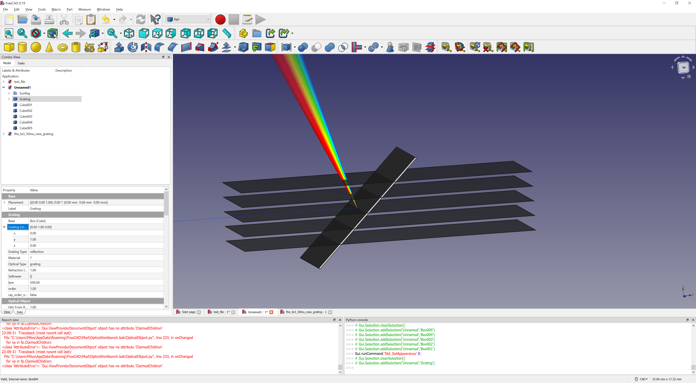
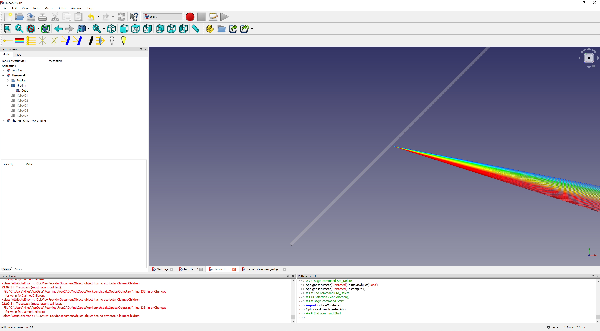
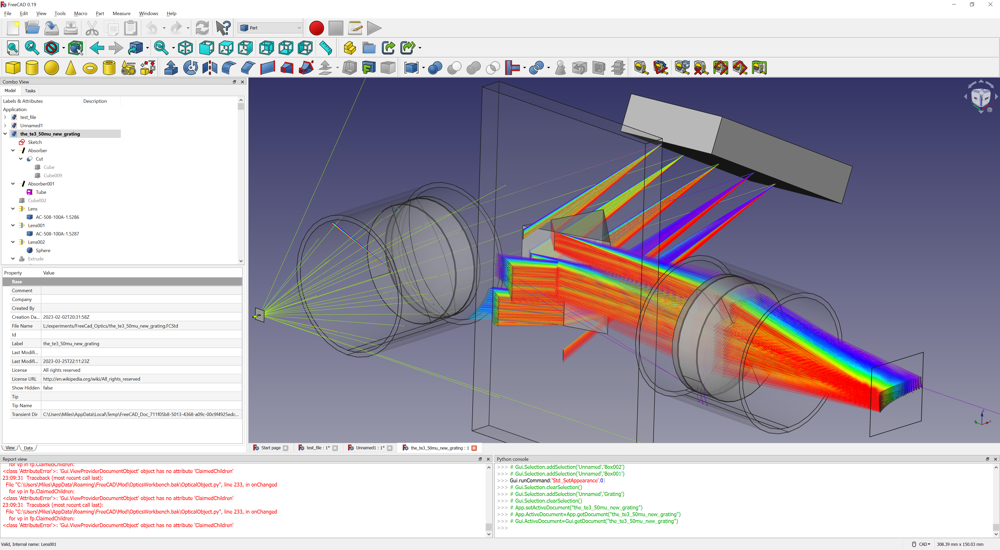
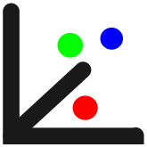
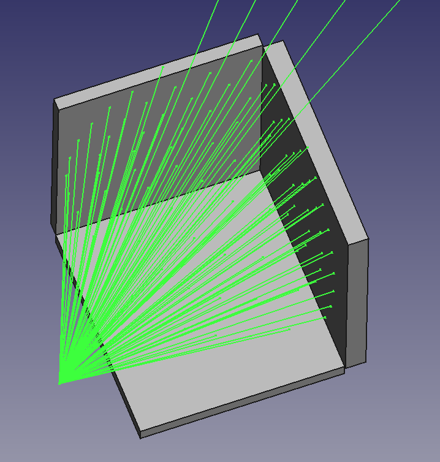
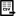
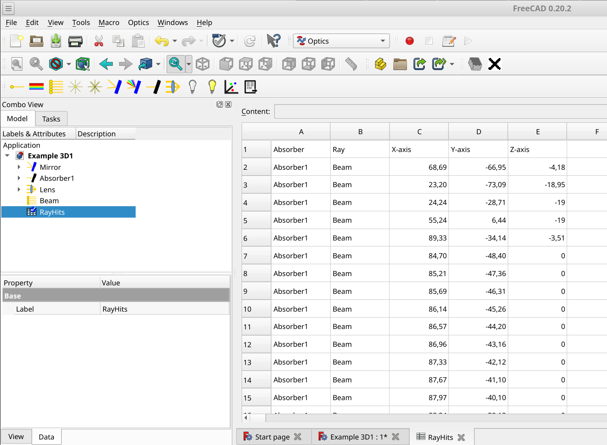

#  Optics Workbench
    
Geometrical optics for FreeCAD.  
Performs simple raytracing through your FreeCAD objects.


  
## Installation

### Auto Installation

Optics workbench is available through the FreeCAD [Addon Manager](https://wiki.freecad.org/AddonManager)

### Manual Installation

<details>
<summary>Expand to view manual installation instructions</summary>

```bash
cd ~/.FreeCAD/Mod/ 
git clone https://github.com/chbergmann/OpticsWorkbench.git
```

</details>

#### Important Note
Once Optics workbench is installed, FreeCAD will need to be restarted. When you restart FreeCAD, "Optics Workbench" workbench should now show up in the [workbench dropdown list](https://freecad.org/wiki/Std_Workbench).
  
## Getting started
- Create some FreeCAD design objects. For 2D simulation Sketches will do the job.
- Select one or more of your design objects and then create Optical Mirror to let your objects act as mirrors
- Select one or more of your design objects and then create Optical Absorber to let your objects act as black walls for the light rays
- Select one or more of your design objects and then create Optical Lenses to let your objects act as lenses. Lenses should be closed shapes. 
Select a material in the Lens properties or provide a refraction index.
- Add some source of light (Ray, Beam). 

## Tools
###  Ray (monochrome)
A single ray for raytracing  
Parameters:
- `Power`: On or Off  
- `Spherical`: `False=Beam` in one direction, `True=Radial` or `spherical` rays
- `BeamNrColumns`: Number of rays in a beam per row
- `BeamNrRows`: Number of rays in a beam per column
- `BeamDistance`: Distance between two beams
- `HideFirstPart`: Hide the first part of every ray that comes from the source and goes to the first point of reflection/refraction/nirvana
- `MaxRayLength`: Maximum length of a ray
- `MaxNrReflections`: Maximum number of reflections. This prevents endless loops if the ray is inside a mirror box.
- `Ignored Optical Elements`: List of optical objects that will be ignored by the ray/beam.

###  Ray (sun light)
A number of rays with different wavelengths of visible light.  
The rays overlap. If they hit a lens, they will be dispersed. See [Example - Dispersion](#-example---dispersion) below.

###  2D Beam
A row of multiple rays for raytracing  
Parameters: 
* Ray. `BeamNrColumns` must be > 1 to get a beam

###  2D Radial Beam
Rays coming from one point going to all directions in a 2D plane  
Parameters: 
* Ray. `BeamNrColumns` must be > 1 and `BeamNrRows=1` and `Spherical=True` to get a radial beam

###  Spherical Beam
Rays coming from one point going to all directions  
Parameters:  
* Ray. `BeamNrColumns` and `BeamNrRows` must be > 1 `Spherical=True` to get a spherical beam

###  Optical Mirror
The FreeCAD objects in parameter Base will act as mirrors  
Select some FreeCAD objects, then create Optical Mirror  
After a ray or beam has been added, a parameter `Hits From Ray/Beam...` will appear.  
This is a counter of how many reflections you have from each ray.  
**Important note:** Do not modify this value.

###  Optical Absorber
The FreeCAD objects in parameter `Base` will swallow the rays of light.  
* Select some FreeCAD objects
* Create Optical Absorber  
* After a ray or beam has been added, a parameter `Hits From Ray/Beam...` will appear. This is a counter of how many rays have hit this absorber. **Important note:** Do not modify this value.  

`Hit coordinates from ... (read only)` records the position of each LIGHT RAY when it hits. This way, it is possible to visualize the image on the absorber in a XY diagram.  
  
  
  
To show an XY plot, open a python console and type:  

```python
import OpticsWorkbench
OpticsWorkbench.plot_xy(App.ActiveDocument.Absorber)
```

###  Diffraction grating
The FreeCAD objects in parameter `Base` will do simple 1D grating simulation to the very superb OpticsWorkbench.  
Raytracing of simple 1D gratings is done following [Ludwig 1973](https://doi.org/10.1364/JOSA.63.001105)  

For this approach, rays now have the additional attribute `order`, which is taken into account when hitting an object specified as optical grating. Utilizing this it is possible to simulate multiple orders of diffraction at one grating by generating rays with the same wavelength but in a different order. 

Gratings are defined by their: 
* type: 
	* reflection
	* transmission with diffraction at 1st surface
	* transmission with diffraction at 2nd surface
* line spacing
* line direction as specified by a hypothetical set of planes intersecting the body and generating the lines as intersecion cuts
* attribute "order"  
Additionally, for transmission gratings a refractive index should be provided.  

Diffraction at a grating object can be specified to be calculated using the order defined by the ray, or by the hit grating, allowing for multiple diffractions of different orders at multiple gratings beeing hit in the path of a single ray.  
**Note** that due to the specific type of this approach to simulate diffraction gratings, one quickly ends up with a large quantity of rays or even sunrays, which consequently heavily increases calculation time.  
**Also note** that bugs in the code might of course be present, however in my testing diffraction (at least for reflection and transmission gratings without taking into account different indices of refactions) is simulated accurately.  


*Above: illustrates a simple reflection grating with 500 lpm hit by sunray. Planes with normal 010 indicate the set of intersecting planes used to define the grating lines direction.*


*Above: shows the same body, defined as transmission grating. Note that the diffraction happens at the 2nd surface as specified by the grating type. Differences in refractive indices are taken into account.*


*Above: an example of a simple echelle spectrometer using a R2 52.91 lpm grating and a set of sunrays from order -47 to -82 (each order comprises ~5-10 nm, sampled by 15 rays around a center wavelength from blue to red) and a flint glass prism. Collimation and camera optics are thorlabs STEP files and a transparent absorber shows the resulting echelle spectrum. Entrance into the spectrometer design is by a 50 mu slit. This is an example with very long calculation time due to the high number of rays. **Note** that the sign of the order is not intuitive. If an error occurs stating that complex numbers are not supported, while diffraction with this order is considered valid by the user, try to change the sign of the order.* 


###  Optical Lens
The FreeCAD objects in parameter Base will act as lenses  
* Select some FreeCAD objects 
* create Optical Lens  
The Refration Index has to be provided. The parameter Material contains a list with pre defined refraction indexes.  
After a ray or beam has been added, a parameter `Hits From Ray/Beam...` will appear. This is a counter of how many refractions you have from each ray.  
**Important note:** Do not modify this value.

###  Switch off lights
Switches off all Rays and Beams

###  (Re)start simulation
Switches on and recalculates all Rays and Beams

###  2D/3D Plot
Select one or more absorber objects and display the location rays hitting them on a scatter graph. It will ignore objects other than absorbers. To only display hits from select beam sources turn off the power for the beams to be ignored. Toggling beams or absorbers visibility in the document tree does not affect the 3D scatter plot output.  
If coordinates in all 3 dimensions are present, a 3D plot will be shown, otherwise you will see a 2D plot only.

 

###  CSV Ray Hits Export
Creates a spreadsheet with the coordinates of all hits of all beams in all absorbers.  
Go to the Spreadsheet workbench for doing further data processing or export the data to a file.



###  Example - 2D


###  Example - 3D


###  Example - Dispersion


## Issues and Troubleshooting
see [issues on Github](https://github.com/chbergmann/OpticsWorkbench/issues)

## Discussion
Please offer feedback or connect with the developer via the [dedicated FreeCAD forum thread](https://forum.freecad.org/viewtopic.php?f=8&t=59860).

## License
GNU Lesser General Public License v3.0 ([LICENSE](LICENSE))
