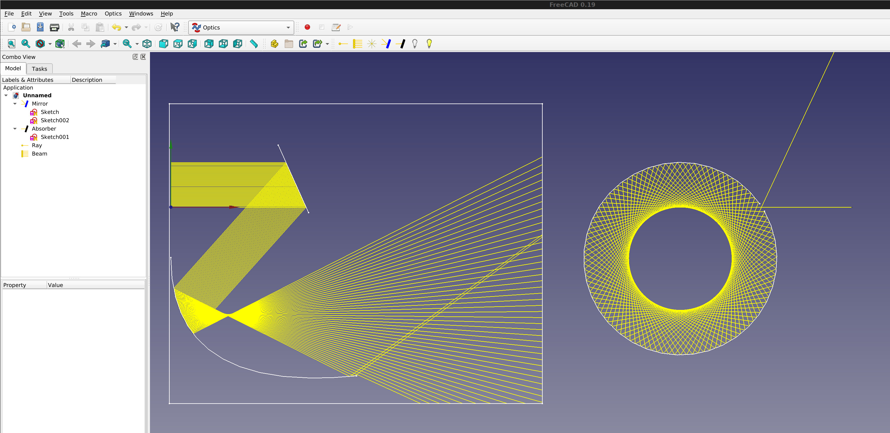

#  Optics Workbench
    
Geometrical optics for FreeCAD.  
Performs simple raytracing through your FreeCAD objects.

[](https://lgtm.com/projects/g/chbergmann/OpticsWorkbench/alerts/)
[](https://lgtm.com/projects/g/chbergmann/OpticsWorkbench/context:python)



## Work in progress !
- Lenses are not yet implemented
  
## Installation


### Manual Installation

```bash
cd ~/FreeCAD/Mod/ 
git clone https://github.com/chbergmann/OpticsWorkbench.git
```
When you restart FreeCAD, "Optics Workbench" workbench should now show up in the [workbench dropdown list](https://freecadweb.org/wiki/Std_Workbench).
  
## Getting started

## Tools
###  Ray
A single ray for raytracing

###  2D Beam
A row of multiple rays for raytracing

###  2D Radial Beam
Rays coming from one point going to all directions in a 2D plane

###  Optical Mirror
The selected FreeCAD objects will act as mirrors

###  Optical Absorber
The selected FreeCAD objects will swallow the rays of light

###  Switch off lights
Switches off all Rays and Beams

###  (Re)start simulation
Switches on and recalculates all Rays and Beams

###  Example 2D
generates the screenshot above

###  Example 3D


## Discussion
Please offer feedback or connect with the developer via the [dedicated FreeCAD forum thread](https://forum.freecadweb.org/viewtopic.php?f=8&t=59860).

## License
GNU Lesser General Public License v3.0
