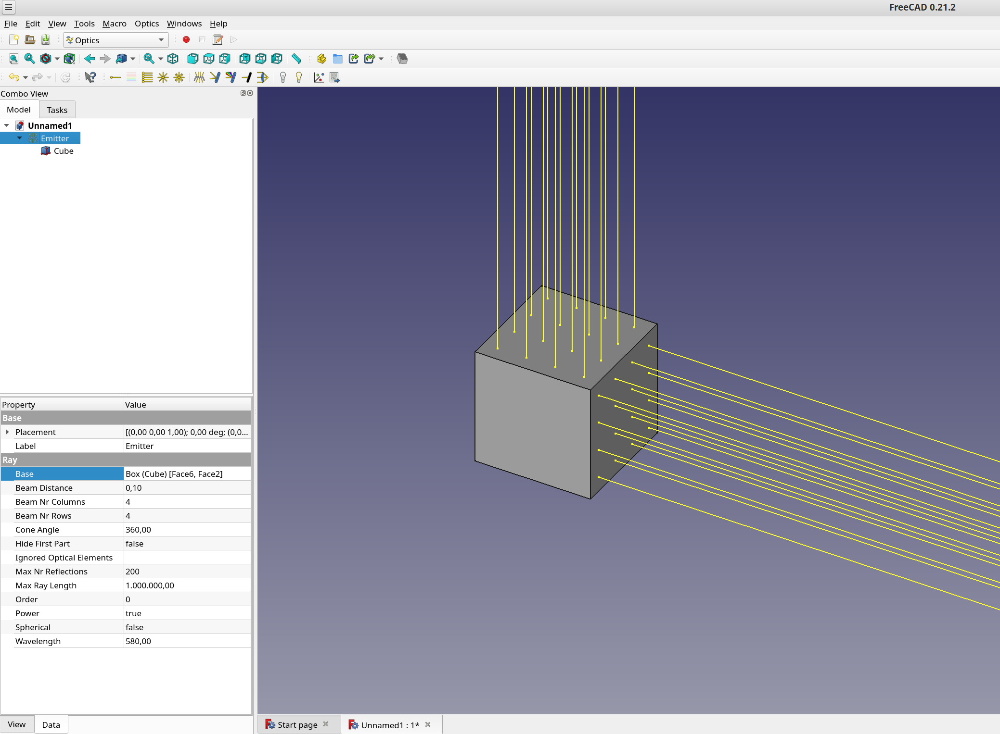
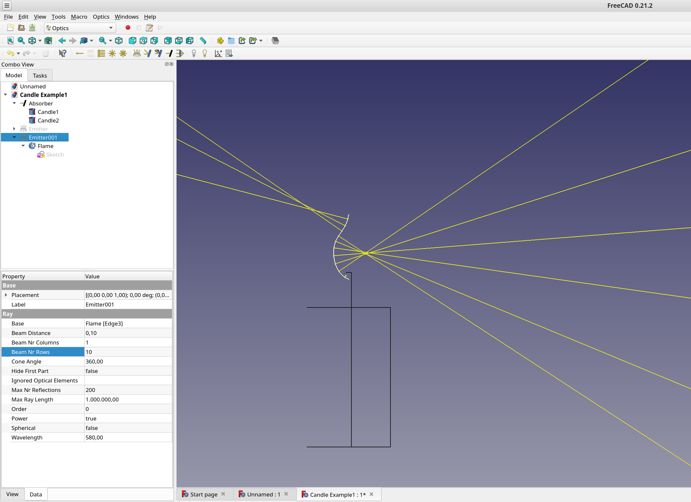
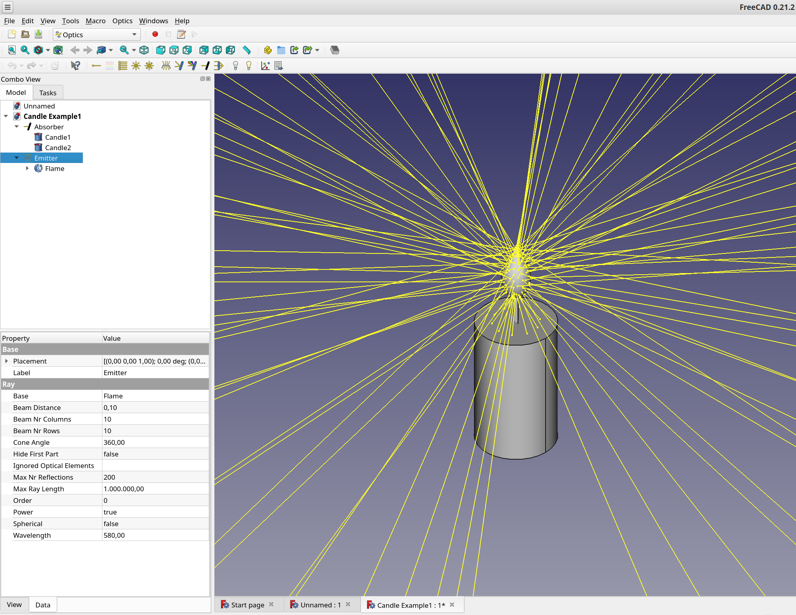
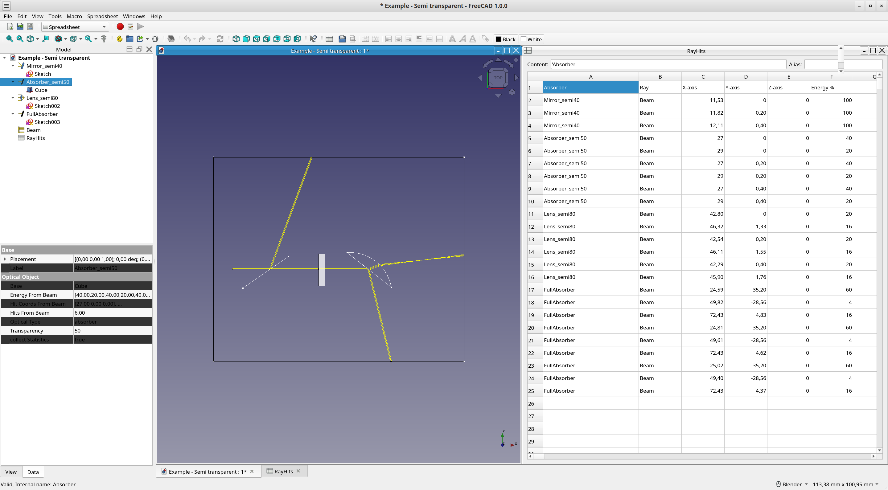

#  Optics Workbench

[ >english< ](README.md)

[ >中文< ](README_zh_TW.md)

Geometrische Optik für FreeCAD.  
Simuliert Lichtstrahlen durch deine FreeCAD Objekte.


  
## Installation

### Auto Installation

Optics workbench kann mit Hilfe des [Addon Manager](https://wiki.freecad.org/AddonManager) installiert werden

### Manuelle Installation

<details>

```bash
cd ~/.FreeCAD/Mod/ 
git clone https://github.com/chbergmann/OpticsWorkbench.git
```

</details>

#### Wichtiger Hinweis
Nach der Installation der Optics Workbench muss FreeCAD neu gestartet werden.
"Optics" ist danach auswählbar in der [workbench dropdown list](https://freecad.org/wiki/Std_Workbench).
  
## Einstieg in Optics workbench
- Erstelle FreeCAD Objekte. Für 2D Simulationen können das Sketche sein.
- Wähle ein oder mehrere FreeCAD objekte aus und klicke dann auf Spiegel, Linse, Absorber oder optisches Gitter, um das Objekt als solches zu verwenden.
- Erstelle eine Lichtquelle (Lichtstrahl, Strahlenbündel, Sonnenstrahl)

## Tools
###  Lichtstrahl (monochrom)
Ein einzelner Lichtstrahl für die optische Simulation.  
Parameter:
- `Power`: An oder aus  
- `Spherical`: Punktförmige Lichtquelle
- `BeamNrColumns`: Anzahl Lichtstrahlen pro Spalte
- `BeamNrRows`: Anzahl Lichtstrahlen pro Reihe
- `BeamDistance`: Abstand zwischen Strahlen
- `Cone Angle`: Lichtkegel Öffnungswinkel
- `HideFirstPart`: Den ersten Teil von jedem Lichtstrahl ausblenden
- `MaxRayLength`: Maximale Länge
- `MaxNrReflections`: Maximale Anzahl von Reflexionen, um Endlosschleifen in geschlossenen Spiegeln zu vermeiden
- `Ignored Optical Elements`: Liste von Ojekten, die ignoriert werden sollen
- `Base`: Falls vorhanden, wird ein Emitter auf Basis dieses Elements generiert

###  Sonnenstrahl
Ein Bündel sich überlappender Lichtstrahlen mit verschiedenen Wellenlängen im sichtbaren Bereich.  
Siehe [Beispiel - Lichtbrechung](#-Beispiel---Lichtbrechung).

###  2D Strahlenbündel
Lichtstrahlen in einer Reihe angeordnet.  
Parameter:
- `BeamNrColumns` muss größer als 1 sein, um ein Strahlenbündel zu bekommen
- `Spherical`: Punktförmige Lichtquelle, muss False sein

###  2D punktförmige Lichtquelle
Punktförmige, radiale Lichtquelle in einer Ebene.  
Parameter:
- `BeamNrColumns` Anzahl Strahlen
- `BeamNrRows` muss 1 sein
- `Spherical`: Punktförmige Lichtquelle, muss True sein
- `Cone Angle`: Lichtkegel Öffnungswinkel

###  Optischer Emitter
Punktförmige Lichtquelle im 3D Raum.  
Parameter:
- `BeamNrColumns` Anzahl Strahlen = `BeamNrColumns` * `BeamNrRows`
- `BeamNrRows` muss größer 1 sein
- `Spherical`: Punktförmige Lichtquelle, muss True sein
- `Cone Angle`: Lichtkegel Öffnungswinkel

###  Optischer Emitter
Die FreeCAD Objekte im Parameter Base werden optische Emitter.  
Wähle ein FreeCAD Objekt, oder eine Oberfläche aus, dann Optischer Emitter.
  
Edges can also be selected as Base: 


Parameter wie in Lichtstrahl (monochrom):  
- `Power`: An oder Aus  
- `BeamNrColumns`: Anzahl Lichtstrahlen in einer Spalte auf der selektierten Oberfläche
- `BeamNrRows`: Anzahl Lichtstrahlen in einer Reihe auf der selektierten Oberfläche
- `Base`: Basis Objekt für optischen Emitter. Bei Festkörpern werden Lichtstrahlen von allen Oberflächen aus generiert. Es ist auch möglich, einzelene Oberflächen auszuwählen.

###  Optischer Spiegel
Die FreeCAD Objekte im Parameter Base werden optische Spiegel.  
* Wähle ein  oder mehrere FreeCAD Objekte aus, dann Optischer Spiegel.  
Parameter:
- `Transparency`: Prozentsatz des Lichts, das den Spiegel passiert. Der Rest wird an der Oberfläche reflektiert
- `collectStatistics` siehe [Statistik](#Statistik)

###  Optischer Absorber
Die FreeCAD Objekte im Parameter Base verschlucken alle auftreffenden Lichtstrahlen. 
* Wähle ein  oder mehrere FreeCAD Objekte aus, dann Optischer Absorber.
Parameter:
- `Transparency`: Prozentsatz des Lichts, das den Absorber passiert
- `collectStatistics` siehe [Statistik](#Statistik)

###  Optisches Gitter
Die FreeCAD Objekte im Parameter Base werden optische Gitter.  
Simulation von einfachen 1D optischen Gittern nach [Ludwig 1973](https://doi.org/10.1364/JOSA.63.001105)  

For this approach, rays now have the additional attribute `order`, which is taken into account when hitting an object specified as optical grating. Utilizing this it is possible to simulate multiple orders of diffraction at one grating by generating rays with the same wavelength but in a different order. 

Gratings are defined by their: 
* type: 
	* reflection
	* transmission with diffraction at 1st surface
	* transmission with diffraction at 2nd surface
* line spacing
* line direction as specified by a hypothetical set of planes intersecting the body and generating the lines as intersecion cuts
* attribute "order"  
Additionally, for transmission gratings a refractive index should be provided.  

Diffraction at a grating object can be specified to be calculated using the order defined by the ray, or by the hit grating, allowing for multiple diffractions of different orders at multiple gratings being hit in the path of a single ray.  
**Note** that due to the specific type of this approach to simulate diffraction gratings, one quickly ends up with a large quantity of rays or even sunrays, which consequently heavily increases calculation time.  
**Also note** that bugs in the code might of course be present, however in my testing diffraction (at least for reflection and transmission gratings without taking into account different indices of refactions) is simulated accurately.  


*Above: illustrates a simple reflection grating with 500 lpm hit by sunray. Planes with normal 010 indicate the set of intersecting planes used to define the grating lines direction.*


*Above: shows the same body, defined as transmission grating. Note that the diffraction happens at the 2nd surface as specified by the grating type. Differences in refractive indices are taken into account.*


*Above: an example of a simple echelle spectrometer using a R2 52.91 lpm grating and a set of sunrays from order -47 to -82 (each order comprises ~5-10 nm, sampled by 15 rays around a center wavelength from blue to red) and a flint glass prism. Collimation and camera optics are thorlabs STEP files and a transparent absorber shows the resulting echelle spectrum. Entrance into the spectrometer design is by a 50 mu slit. This is an example with very long calculation time due to the high number of rays. **Note** that the sign of the order is not intuitive. If an error occurs stating that complex numbers are not supported, while diffraction with this order is considered valid by the user, try to change the sign of the order.* 


###  Optische Linse
Die FreeCAD Objekte im Parameter Base werden optische Linsen.  
Wähle ein  oder mehrere FreeCAD Objekte aus, dann Optische Linse.  
Parameter:
- `RefractionIndex` Brechungsindex
- `Sellmeier` Brechungsindex in Abhängigkeit der Wellenlänge
- `Material` Die Auswahl eines Material stellt Brechungsindex und Sellmeier Parameter ein
- `Transparency`: Prozentsatz des Lichts, das die Linse passiert. Der Rest wird an der Oberfläche reflektiert
- `collectStatistics` siehe [Statistik](#Statistik)

###  Licht ausschalten
Alle Lichtquellen deaktivieren.

###  Simulation neu starten
Alle Lichtstrahlen neu berechnen.

## Statistik
Die optischen Objekte haben einen Parameter `collectStatistics`. Wenn true, werden Statistiken von auftreffenden Lichtstrahlen gesammelt:  
- `Hits From Ray/Beam...` Anzahl Strahl-Treffer (schreibgeschützt)  
- `Hit coordinates from ... ` Koordination vom Strahl-Treffer (schreibgeschützt)  


###  2D/3D Plot
Zeigt eine Graphik mit den Strahl-Treffer Koordinaten von ausgewählten optischen Objekten mit dem Parameter `collectStatistics` = true

 
  

###  CSV Ray Hits Export
Exportiert die Statistik von ausgewählten optischen Objekten mit dem Parameter `collectStatistics` = true in eine Tabelle.  
Weitere Datenverarbeitung und Speichern in Datei ist dann über die Spreadsheet workbench möglich.


###  Beispiel - 2D


###  Beispiel - 3D


###  Beispiel - Lichtbrechung


###  Beispiel - Emitter

-
###  Beispiel - Halb-Transparenz


## Fehlersuche und Report (englisch)
siehe [issues on Github](https://github.com/chbergmann/OpticsWorkbench/issues)

## Diskussion (englisch)
Please offer feedback or connect with the developer via the [dedicated FreeCAD forum thread](https://forum.freecad.org/viewtopic.php?f=8&t=59860).

## Lizenz
GNU Lesser General Public License v3.0 ([LICENSE](LICENSE))
